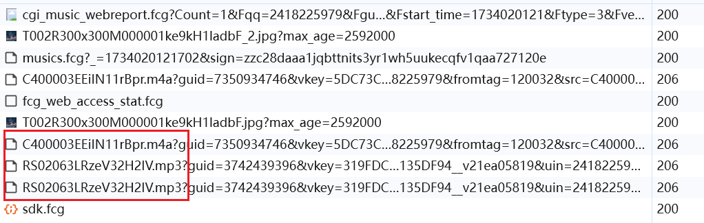
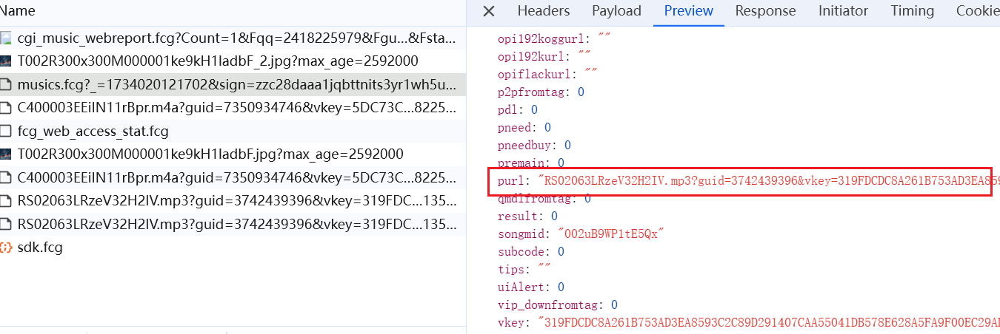
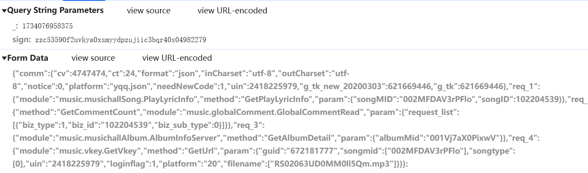
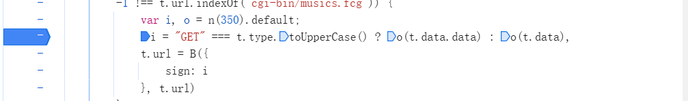
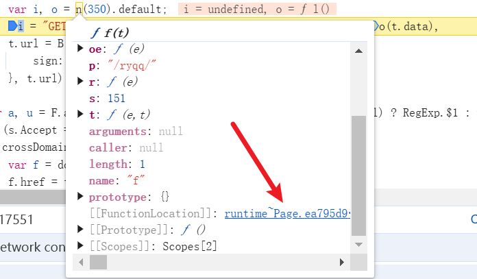
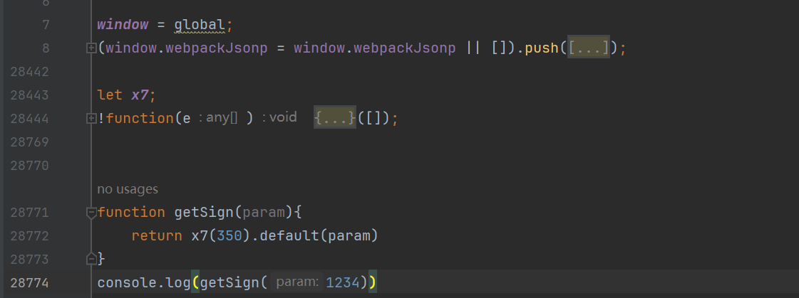
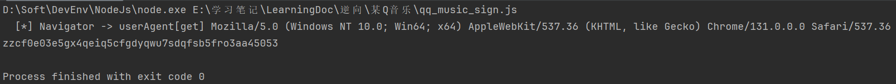
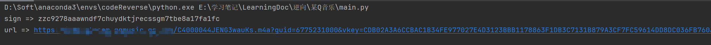

# 某Q音乐sign逆向以及参数构造

### 0x01目标

​	确定目标，下载指定音乐

### 0x02确定请求

​	播放歌曲，查看请求情况，注意这边要播放一首没有播放过的，有缓存的话不会再发起请求，主要关注媒体文件，下面m4a和mp3的请求应该就是返回的音乐文件，双击打开正常播放。

​	搜索这个文件名，看之前的请求中是否返回资源地址，果然在一个/cgi-bin/musics.fcg的API中发现了地址，那就重点分析这个API。

### 0x03确定加密参数

​	首先请求参数中有一个sign肯定是重点的关注对象，然后就是看表单中的数据是如何构造的。

​	

### 0x04逆向分析

​	全局搜索sign，定位到生成代码，打上断点，可以看到sign = i,i是由o函数进行加密生成的，这边断点之后看到t.data就是我们的表单数据。



​	可以说到这其实逆向已经结束了(◕ᴗ◕✿)。因为我们可以明显的看到0函数的特征，一个n函数传入数字作为参数，明显是webpack加载模块的函数，那就用webpack的通用流程，抠出加载器代码以及加密模块的代码即可，鼠标放到n函数上会有一个构造函数位置，点击构造函数即可跳转到加载器所在位置。



​	点进去可以看到是一个自执行函数，将整个函数抠出，在函数外部定义一个变量，用于将加载器导出供我们使用，里面有很多f点的函数，那么这个f函数就是我们需要的东西，在内部使用我们外面定义的变量导出即可。

```js
let x7;
!function(e) {
....代码省略
 x7 = f;
....
}
```

​	这样我们就可以在外面使用x7去加载加密函数的模块了，加密函数的位置也很好确定，鼠标移到default上同样的点击构造函数位置即可进行跳转，然后将整个模块抠出，注意window对象需要处理下，因为node环境是没有window这个对象的，可以试用global对其进行赋值，扣好代码使用x7(350).default()即可调用加密函数进行加密测试。



​	可以看到这个加密模块抠出来两万多行代码，运行代码后发现加密内容与浏览器不一致，那大概就是中间有校验环境了，那我们生成一个临时环境就可以了，还是使用js_tool浏览器插件生成一个浏览器临时环境，然后放到我们的js里面去，再次进行加密。可以看到执行过程中果然读取了ua信息，并且生成的加密内容与浏览器一致了。

### 0x05调用测试

​	变换请求参数，这边的参数构造可以通过播放不同的歌曲，看下哪些是需要变化的，大致有以下三个也就是歌曲的相关信息，这些信息保存在LocalStorage的playSongData中，当然我们正常肯定是再找一个返回歌曲信息的API，然后从里面解析出来。

```js
//  示例信息
songMID = "00184ejM4XouuN"
songID = "1021078"
albumMid = "003YQ8lP3NBXKl"
```

​	发起请求请求进行测试，sign正常生成，url获取成功



### 0x06总结

​	这是第二个关于webpack的例子，现在网站确实有很多通过webpack进行打包编译的，所以这种例子也比较多，逆向的流程也比较明晰，不追求纯算的话，直接扣除加载器代码以及加密模块对应的模块代码即可。测试如果和浏览器环境生成的值不一致的话，多半是因为算法校验环境了，返回了一个错误的内容，补全一下所需环境即可。