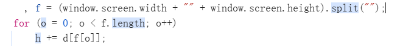

# 某度账号注册接口sig、shaOne逆向

> ​	声明：本文章中所有内容仅供学习交流使用，不用于其他任何目的，不提供完整代码，抓包内容、敏感网址、数据接口等均已做脱敏处理，严禁用于商业用途和非法用途，否则由此产生的一切后果均与作者无关.本文章未经许可禁止转载，禁止任何修改后二次传播，擅自使用本文讲解的技术而导致的任何意外，作者均不负责。

### 0x01 目标

​	查询指定手机号是否注册某度账号。

### 0x02 确定加密参数

​	变更手机号，多次请求，观察网络包变化，发现除了时间戳外有几个参数在变化，一个是**sig**，一个是**shaOne**，还有一个callback，当然这个是无关紧要的。

### 0x03 逆向分析

​	首先注意请求类型，该请求并非xhr或者fetch请求，而是有script标签发出的请求，所以不要用xhr断点，这样是断不住的，直接看请求栈，跳到一个_checkRegPhone的方法中打上断点。

​	

​	再次点击发送验证码，成功断下，跟进getphonestatus中,sig和shaOne主要在u.jsonp函数中生成，r(n, e, d[e], g[e], !1)生成了一系列参数，包括token，但是token在变换参数时也是不变的，这边忽略，直接进jsonp函数。

```js
return u.jsonp(l + t, r(n, e, d[e], g[e], !1), {
    charset: "utf-8",
    processData: function(t) {
        return a(e, t)
    }
})
```

​	跟进jsonp函数，上面一堆逻辑就是为了选出一个y值决定执行生成参数的函数

```js
.......
var y = h[w[v]] || "";
window.moonshadV3 && window.moonshadV3[y] && r && (r = baidu.extend(r, window.moonshadV3[y](i, baidu)))
```

最终通过生成的y确定了一个函数执行最后的window.moonshadV3[y]函数，传入i和baidu，i是请求参数。跟进这个函数，这边就跟到了sig和shaOne生成的地方。


#### shaOne分析	

首先是shaOne，来自于变量a，往上检索a生成的位置，出现以下代码，一个for循环，两个嵌套函数，断点到这，先看第一个函数生成的值，返回了一个32位的字符串，应该是MD5，在控制台输入d(1)测试，返回c4c开头，标准的MD5函数。

```js
var o, a = "";
for (o = a = (new Date).getTime(); "00" !== (a = l(d(a))).toString().substr(0, 2); );
```


在使用l加密测试，对比之后发现是标准的sha1函数，所以这边的逻辑就是将时间戳进行循环嵌套加密，直到生成的值前两位是00为止。

#### sig分析

​	解下来分析sig的生成，断点到sig的生成位置,跟进encryption函数。

```js
sig: h.encryption(i, r, e),
```

​	加密函数首先将传入的参数对象拆解成了key=value形式的数组，然后使用&将其连接成一个字符串，在使用MD5对生成的字符串进行加密。


​		然后获取屏幕的宽高进行拼接将数字拆解成数组，根据这个数字组合的数组，从一个打乱顺序的1-9a-z的组合对象中形成一组字符串



​	将这组字符串和上面MD5生成的字符串分解成字符数组，然后将两个数组穿插拼接在一起，通过AES加密将拼接的字符串进行加密，加密后再进行base64编码形成sig的值

### 0x05 总结

​	这个接口还是挺简单的，没有混淆，还有一个指纹这边没分析，就是获取了一些环境信息，然后将这些环境信息进行MD5加密得到。一般来说，同一设备指纹是不会变的，所以固定即可。