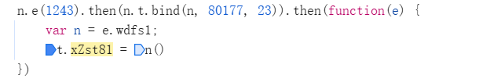
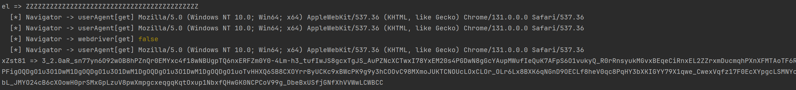
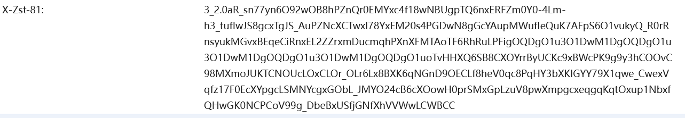
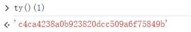
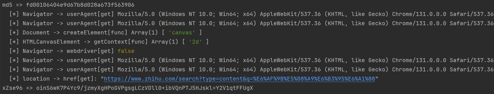
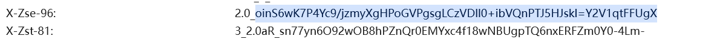
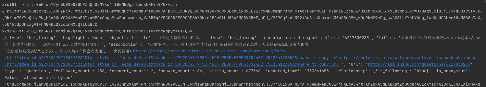

# 某乎81和96参数逆向、补环境

### 0x00 加密参数

​	老规矩，先找加密参数，复制请求，请求参数中未发现加密内容，是明文传输的，那就只能是在Header和Cookie中动手脚，Cookie删个遍都不影响请求，所以关键是在Header中，从标题就能看出来，加密的项分别是x-zse-96和x-zst-81，这两个删掉任意一个都会导致请求失败

### 0x01 定位参数

​	通过全局搜索x-zst-81发现可疑代码，这边应该就是设置参数的地方，下断点确认tC和tT拼接的值是否和请求一致，发现是一致的

### 0x02 xZst81逆向

​	找到设置的代码后，要往上一直跟到tC和tT的生成位置，大致顺序如下

​	往上找tC的值，看看咋来的

```js
->0 tC = td.xZst81 || tp.get("x-zst-81")  //这边tp其实就是Headers，难道说之前就已经将x-zst-81赋过值？
->1 tp = new Headers(t_({}, tf.headers));  //这边生成的过程中果然赋了一个值，并且tf.headers里面包含了x-zst-81
->2 tf = tD(ti, ep)  // 这一步其实不用管，因为传入的参数ti中已经有x-zst-81，并且经过对比，值是相同的，该函数并没有操作该值
->3 var ti = void 0 === tr ? {} : tr  //tr是参数传递进行来，往上跟栈
```

​	继续往上跟栈查找tr是咋来的，发现tr来自于q.xZst81，当前函数内未发现对q的赋值操作，所以是在q是一个全局变量，在外部进行生成。直接搜索xZst81看是在哪进行的赋值。可以看到这边通过一个n函数进行了赋值。

​	

​	跟进n函数，跳到目标函数,这边的d是从localStorage取osa，f是从Cookie取osd，然后调用F函数进行处理，搜索ei看是怎么来的。

```js
var x = {};
x[H("0x19b")] = function(x, d, f, v) {
    return x(d, f, v)
};
var d = en[H("0x8a")](eA), f = er[H("0x8a")](ed);
return d ? x[H("0x19b")](F, d, f, ei) : ""
```

​	搜到关键代码ei = O(!1, 43)，跟O函数，简而言之就是随机从0-9，a-z，A-Z的字符串数组中取43个字符组成一个随机的字符串。简化后代码如下。

```js
function ei(x, d, f){
    var U = "", V = d;
    var M = ["0", "1", "2", "3", "4", "5", "6", "7", "8", "9", "a", "b", "c", "d", "e", "f", "g", "h", "i", "j", "k", "l", "m", "n", "o", "p", "q", "r", "s", "t", "u", "v", "w", "x", "y", "z", "A", "B", "C", "D", "E", "F", "G", "H", "I", "J", "K", "L", "M", "N", "O", "P", "Q", "R", "S", "T", "U", "V", "W", "X", "Y", "Z"];
    for (var y = 0; y < V; y++) {
        var O = Math.round(Math.random() * 61);
        U += M[O]
    }
    return U;

}
```

​	加密函数不用跟，这边就不追求纯算直接扣代码了，一般这种加密算法都很绕，各种读环境变换。所以直接扣代码，补环境就好了。

 ```js
 var T = new D;
 return T.e = [0],
     T.e[0] = v,
     T.b(x.R, 752, x.I, []),  // 主要加密函数
     T.c[3]
 ```

```js
D.prototype.b = function(x, d, f) {
    for (d = d || 0,
         f = f || [],
         this.k = d,
         "string" == typeof x ? this.x(x) : (this.R = x,
                                             this.I = f),
         this.C = !0,
         this.J = Date.now(); this.C; ) {
        var v = this.R[this.k++];
        if ("number" != typeof v)
            break;
        var T = Date.now();
        if (5e8 < T - this.J)
            return;
        this.J = T;
        try {
            this.a(v)  //  主要逻辑
        } catch (x) {
            this.Y = x,
                this.D && (this.k = this.D)
        }
    }
}
```

将整个D类相关的代码抠出来，固定random函数进行调试,保证我们的代码和页面能输出一致的内容。

```js
Math.random = function (){
    return 1;
};
```

代码抠出来运行发现就算固定了随机函数内容还是不一样，这是因为算法会校验浏览器环境，所以我们要补充环境，这边用js_tool直接吐环境。浏览器安装js_tool插件，打开点击生成临时环境，然后直接复制生成的代码到我们的代码里面，运行测试与浏览器生成一致。	



### 0x03 xZse96逆向

​	接下来开始对xZse96参数进行逆向，Tt就是对应的参数

```js
->0 tT = tO.signature
//  te是请求路径加参数，tf.body应该就是body内容，此处为空，tb是固定参数，也就是Header中的x-zse-93，值为101_3_3.0，tS是一段字符串加一个类似时间戳的形式，tC是另一个加密参数。
->1 tO = ed(te, tf.body, { zse93: tb, dc0: tS, xZst81: tC }, tA)
```

	这边tS就在这段代码上面，所以先跟tS看看是啥，发现是用正则提取了Cookie中d_c0的值，但是多次请求，似乎没发生变化，不过这边有时间戳，不排除后端会检索有效时间，因为这边还不明白ed这个函数做了些啥。后续进行分析。

```js
t9 = RegExp("d_c0=([^;]+)")
var tt = t9.exec(document.cookie);
return tt && tt[1]
```

xZse96是在上面分析的ed函数返回的，所以这边主要分析ed函数做了些啥。

```js
function ed(tt, te, tr, ti) {
    var ta = tr.zse93
    , tu = tr.dc0
    , tc = tr.xZst81
    , tf = t3(tt)
    , td = t6(te)
    , tp = [ta, tf, tu, t8(td) && td, tc].filter(Boolean).join("+");
    // 上面就是将固定参数tb（101_3_3.0）、带参数的uri路径、dc0的值、以及上面生成的xZst81的值通过+拼接在一起
    return {
        source: tp,
        signature: (0,
                    tJ(ti).encrypt)(ty()(tp))
    }
}
```

然后是关键的加密函数(0，tJ(ti).encrypt)(ty()(tp))，先执行ty()(tp)，再将值执行tJ(ti).encrypt（value）,通过调试发现ty()(tp)返回的是一个32位的字符串，合理怀疑是一个md5函数，通过其加密一个1试一下，返回c4c很明显是标准的md5加密。



直接进encrypt函数看，又是和上面一样的new一个对象进行加密，那就直接扣代码。加密是一个if + switch的平坦流，看着都头痛。经过漫长的扣代码和补环境之后，其实直接使用上面的那套环境即可，主要是扣代码，我们终于生成了一个和页面一致的参数。可以看到加密过程中多次校验浏览器环境。





### 0x04 调用测试

​	通过生成的参数，改变参数构造请求，发起测试。成功获取想要的数据。

### 0x05 总结

​	第一次接触知乎参数还是大学做毕设的时候，想爬取用户评论，那时候真的是啥都不懂，完全没思路，觉得很神奇，复制的请求只要变化参数后就不会正常响应了。然后慢慢的摸索，了解逆向，了解请求加密、参数加密、令牌、Cookie加密。了解md5，RSA，AES等加密算法。简单的明文JS逆向、混淆JS逆向、WebPack。摸索的过程中也学到了很多东西。

​	在逆向的过程中我们发现xZst81这个参数其实是可以固定的，因为它使用的osa、osd是可以固定的，当我们将随机函数也固定之后，那么他每次生成的内容就是一样的了。所以重点关注96的生成就好了，因为96加了参数进行混淆，参数变化，96肯定变化。

​	这也算我第一个扣代码补环境的项目了，其实我还扣了一套浏览器环境用于rpc的代码，但是觉得rpc始终没有本地执行的好，害得起一个浏览器。环境也是一键生成的代码，非常好用。接下来就是扣下某博、某吧的算法了，如果可以在试试某音，扣这些其实想做一个整合的搜索工具，也算是完成毕设没有实现的想法了，打破信息茧房。
